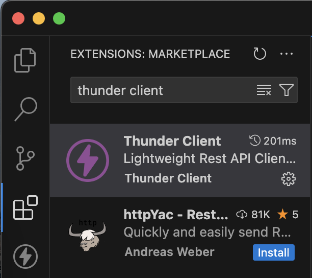
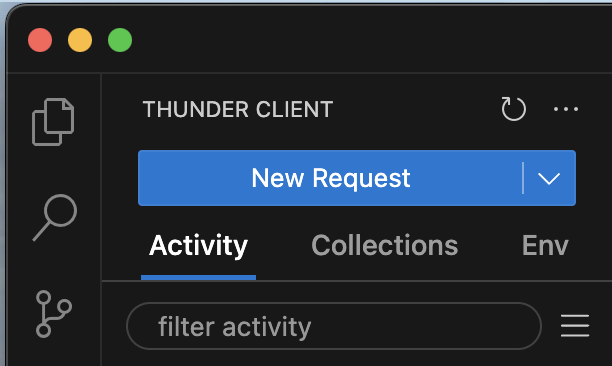
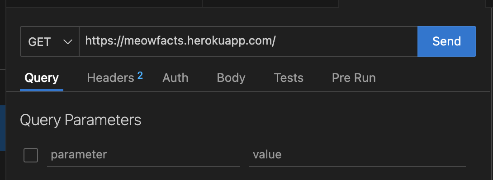

# 8.2 - Thunder Client

> [!INFO] How to Use Thunder Client
> 1. Click the "Lightning bolt" icon on the left of your screen, past the file viewer.
> 
> 
> 
> 2. Then, hitting "New Request" will allow you to continue using Thunder Client to do API examples.
> 
> 
> 
> You can enter your chosen API, configure the Query Parameters, and hit "Send" to see the result from the API!

> [!INFO] Parameters
> Remember to hit the checkbox next to your parameter to enable it, if it's not checked already!
> 

> [!TIP] Inspect your data!
> It's good to have a go at inspecting the data you get back from an API request. In Javascript, you may need to use array or dictionary accesses in order to fully access this data.

> [!INFO] Dictionaries & accessing them
> A dictionary, written with curly braces `{}`, can be accessed with strings.
> 
> The dictionary
> ```js
> let dict = {data: "hello"}
> ```
> can be accessed with `dict["data"]`.


> [!SUCCESS] Try it yourself
> - Pick an API from the list in the API page, or use our meow facts API: `https://meowfacts.herokuapp.com/` (you can find documentation [here](https://github.com/wh-iterabb-it/meowfacts)), and try various different requests to see how the API responds.
> - Find out what happens when you pass an API invalid query parameter. Different APIs may respond differently!
