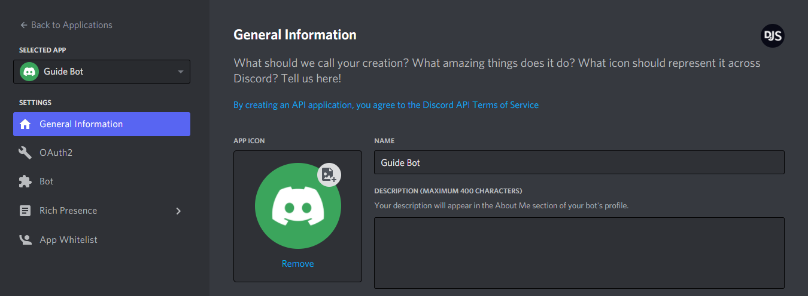
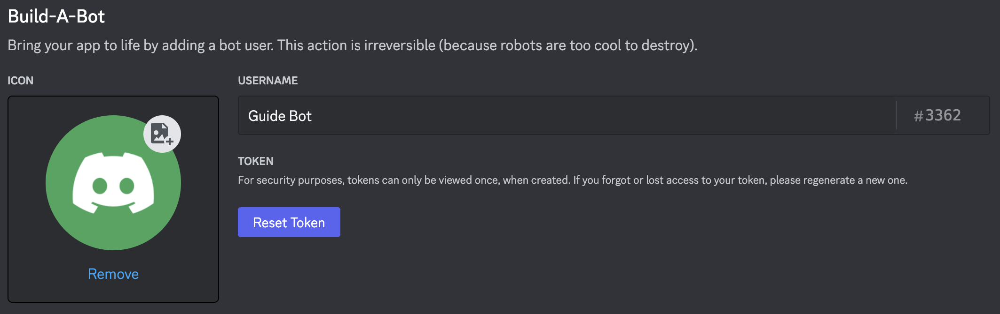
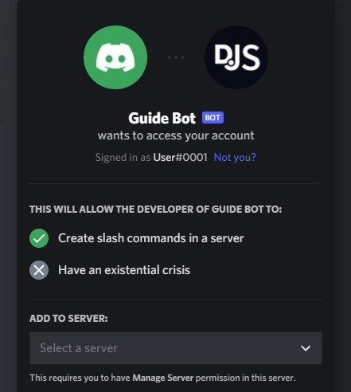
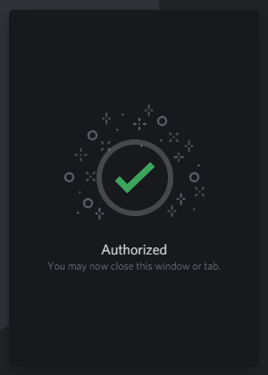
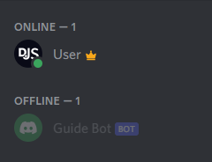

# Task 1: Hello World!

> [!INFO] Highlights 
> Helloo!!!!

# Installing Node.js and discord.js

## Installing Node.js

To use discord.js, you'll need to install the latest LTS version of [Node.js](https://nodejs.org/).

> [!TIP]
> To check if you already have Node installed on your machine, run `node -v` in your terminal. It is recommended to use the latest LTS version of Node.

On Windows, it's as simple as installing any other program. Download the latest version from [the Node.js website](https://nodejs.org/), open the downloaded file, and follow the steps from the installer.

## Preparing the essentials

To use discord.js, you'll need to install it via npm \(Node's package manager\). npm comes with every Node installation, so you don't have to worry about installing that. However, before you install anything, you should set up a new project folder.

Navigate to a suitable place on your machine and create a new folder named `discord-bot` (or whatever you want). Next you'll need to open your terminal.

### Opening the terminal

> [!TIP]
> If you use [Visual Studio Code](https://code.visualstudio.com/), you can press <code>Ctrl + `</code> (backtick) to open its integrated terminal.

On Windows, either:

- `Shift + Right-click` inside your project directory and choose the "Open command window here" option
- Press `Win + R` and run `cmd.exe`, and then `cd` into your project directory

On macOS, either:
- Open Launchpad or Spotlight and search for "Terminal"
- In your "Applications" folder, under "Utilities", open the Terminal app

On Linux, you can quickly open the terminal with `Ctrl + Alt + T`.

With the terminal open, run the `node -v` command to make sure you've successfully installed Node.js.

### Initiating a project folder

```sh:no-line-numbers
npm init
```

This is the next command you'll be running. This command creates a `package.json` file for you, which will keep track of the dependencies your project uses, as well as other info.

This command will ask you a sequence of questions–you should fill them out as you see fit. If you're not sure of something or want to skip it as a whole, leave it blank and press enter.

> [!TIP]
> To get started quickly, you can run the following command to have it fill out everything for you.
<CodeGroup>
  <CodeGroupItem title="npm">

```sh:no-line-numbers
npm init -y
```

Once you're done with that, you're ready to install discord.js!

## Installing discord.js

Now that you've installed Node.js and know how to open your console and run commands, you can finally install discord.js! Run the following command in your terminal:

```sh:no-line-numbers
npm install discord.js
```

And that's it! With all the necessities installed, you're almost ready to start coding your bot.

# Setting up a linter

As a developer, it's a good idea to make your development process as streamlined as possible. Linters check syntax and help you produce consistent code that follows specific style rules that you can define yourself or inherit from existing configurations. Although it's not required, installing a linter will help you immensely.

## Installing a code editor

First, you will need a proper code editor. Using programs such as Notepad and Notepad++ is discouraged, as they're inefficient for projects like these. If you aren't using one of the editors listed below, it's advised to switch.

* [Visual Studio Code](https://code.visualstudio.com/) is a prevalent choice; it is known for being fast and powerful. It supports various languages, has a terminal, built-in IntelliSense support, and autocomplete for both JavaScript and TypeScript. This is the recommended choice.
* [Sublime Text](https://www.sublimetext.com/) is another popular editor that's easy to use and write code with.

## Installing a linter

Install the [ESLint package](https://www.npmjs.com/package/eslint) inside your project directory.

```sh:no-line-numbers
npm install --save-dev eslint @eslint/js
```

## Setting up ESLint rules

ESLint may display many warnings and errors about your code when you start using it but don't let this startle you. To get started, create a file in your project directory named `eslint.config.js` and copy the code below into the file:

```javascript
const js = require('@eslint/js');

module.exports = [
	js.configs.recommended,
	{
		languageOptions: {
			ecmaVersion: 'latest',
		},
		rules: {

		},
	},
];
```

This is the basis of how an ESLint file will look. The `rules` object is where you'll define what rules you want to apply to ESLint. For example, if you want to make sure you never miss a semicolon, the `"semi": ["error", "always"]` rule is what you'll want to add inside that object.

You can find a list of all of ESLint's rules on [their website](https://eslint.org/docs/rules). There are indeed many rules, and it may be overwhelming at first, so if you don't want to go through everything on your own yet, you can use these rules:

```javascript
const js = require('@eslint/js');

module.exports = [
	js.configs.recommended,
	{
		languageOptions: {
			ecmaVersion: 'latest',
		},
		rules: {
			'arrow-spacing': ['warn', { before: true, after: true }],
			'brace-style': ['error', 'stroustrup', { allowSingleLine: true }],
			'comma-dangle': ['error', 'always-multiline'],
			'comma-spacing': 'error',
			'comma-style': 'error',
			curly: ['error', 'multi-line', 'consistent'],
			'dot-location': ['error', 'property'],
			'handle-callback-err': 'off',
			indent: ['error', 'tab'],
			'keyword-spacing': 'error',
			'max-nested-callbacks': ['error', { max: 4 }],
			'max-statements-per-line': ['error', { max: 2 }],
			'no-console': 'off',
			'no-empty-function': 'error',
			'no-floating-decimal': 'error',
			'no-inline-comments': 'error',
			'no-lonely-if': 'error',
			'no-multi-spaces': 'error',
			'no-multiple-empty-lines': ['error', { max: 2, maxEOF: 1, maxBOF: 0 }],
			'no-shadow': ['error', { allow: ['err', 'resolve', 'reject'] }],
			'no-trailing-spaces': ['error'],
			'no-var': 'error',
			'no-undef': 'off',
			'object-curly-spacing': ['error', 'always'],
			'prefer-const': 'error',
			quotes: ['error', 'single'],
			semi: ['error', 'always'],
			'space-before-blocks': 'error',
			'space-before-function-paren': ['error', {
				anonymous: 'never',
				named: 'never',
				asyncArrow: 'always',
			}],
			'space-in-parens': 'error',
			'space-infix-ops': 'error',
			'space-unary-ops': 'error',
			'spaced-comment': 'error',
			yoda: 'error',
		},
	},
];
```

If your current code style is a bit different, or you don't like a few of these rules, that's perfectly fine! Just head over to the [ESLint docs](https://eslint.org/docs/rules/), find the rule(s) you want to modify, and change them accordingly.

# Setting up a bot application

## Creating your bot

Now that you've installed Node, discord.js, and hopefully a linter, you're almost ready to start coding! The next step you need to take is setting up an actual Discord bot application via Discord's website.

It's effortless to create one. The steps you need to take are as follows:

1. Open the [Discord developer portal](https://discord.com/developers/applications) and log into your account.
2. Click on the "New Application" button.
3. Enter a name and confirm the pop-up window by clicking the "Create" button.

You should see a page like this:



You can edit your application's name, description, and avatar here. Once you've done that, then congratulations—you're now the proud owner of a shiny new Discord bot! You're not entirely done, though.

## Your bot's token

::: danger
This section is critical, so pay close attention. It explains what your bot token is, as well as the security aspects of it.
:::

After creating a bot user, you'll see a section like this:



In this panel, you can give your bot a snazzy avatar, set its username, and make it public or private. Your bot's token will be revealed when you press the "Reset Token" button and confirm. When we ask you to paste your bot's token somewhere, this is the value that you need to put in. If you happen to lose your bot's token at some point, you need to come back to this page and reset your bot's token again which will reveal the new token, invalidating all old ones.

### What is a token, anyway?

A token is essentially your bot's password; it's what your bot uses to login to Discord. With that said, **it is vital that you do not ever share this token with anybody, purposely or accidentally**. If someone does manage to get a hold of your bot's token, they can use your bot as if it were theirs—this means they can perform malicious acts with it.

# Adding your bot to servers

After you [set up a bot application](/preparations/setting-up-a-bot-application.md), you'll notice that it's not in any servers yet. So how does that work?

Before you're able to see your bot in your own (or other) servers, you'll need to add it by creating and using a unique invite link using your bot application's client id.

## Bot invite links

The basic version of one such link looks like this:

```:no-line-numbers
https://discord.com/api/oauth2/authorize?client_id=123456789012345678&permissions=0&scope=bot%20applications.commands
```

The structure of the URL is quite simple:

* `https://discord.com/api/oauth2/authorize` is Discord's standard structure for authorizing an OAuth2 application (such as your bot application) for entry to a Discord server.
* `client_id=...` is to specify _which_ application you want to authorize. You'll need to replace this part with your client's id to create a valid invite link.
* `permissions=...` describes what permissions your bot will have on the server you are adding it to.
* `scope=bot%20applications.commands` specifies that you want to add this application as a Discord bot, with the ability to create slash commands.

::: warning
If you get an error message saying "Bot requires a code grant", head over to your application's settings and disable the "Require OAuth2 Code Grant" option. You shouldn't enable this option unless you know why you need to.
:::

## Creating and using your invite link

To create an invite link, head back to the [My Apps](https://discord.com/developers/applications/me) page under the "Applications" section, click on your bot application, and open the OAuth2 page.

In the sidebar, you'll find the OAuth2 URL generator. Select the `bot` and `applications.commands` options. Once you select the `bot` option, a list of permissions will appear, allowing you to configure the permissions your bot needs.

Grab the link via the "Copy" button and enter it in your browser. You should see something like this (with your bot's username and avatar):



Choose the server you want to add it to and click "Authorize". Do note that you'll need the "Manage Server" permission on a server to add your bot there. This should then present you a nice confirmation message:



Congratulations! You've successfully added your bot to your Discord server. It should show up in your server's member list somewhat like this:

