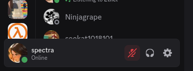
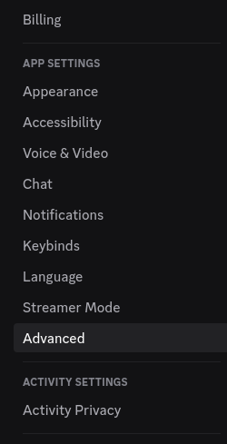
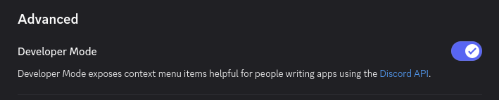
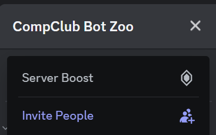
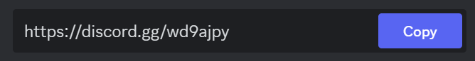
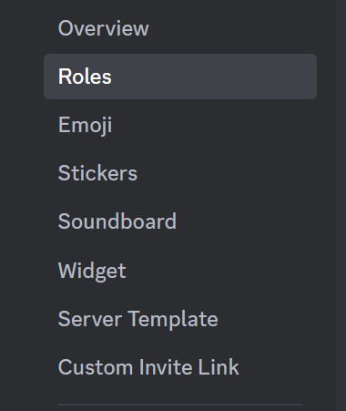
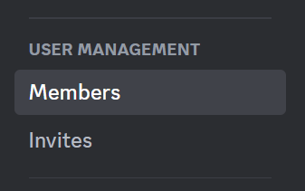
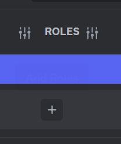

# Setting up your Discord account

On this page, we'll run you through all the steps to get started building your first Discord bot!

## Create a Discord account

If you have a Discord account already, skip to the next section.

To make a Discord account, go to the [registration page](https://discord.com/register), and fill out your details.

> [!WARNING] To use Discord you need to be 13+
> Discord's Terms of Service requires that its users be over the age of 13 in Australia.
> If you are making your own account, you should be careful about what age you give Discord.
> Ask a mentor to borrow a Discord account we've made already, if you need one.

> [!TIP] Join your first server
> Hey, now that you have a Discord account, why not join [the CompClub Community Discord Server](https://discord.gg/WuyTgzYK)?
> It's a way to meet other people your age that are interested in computing, and to get help from our team of passionate mentors.
> Ask a mentor for more information about the server.

## Enable Developer Mode on your account

When you're writing the code for your application, in order to reference a particular user, channel, server, etc. you'll have to refer to it by its *ID*.
For example, the guild ID for the CompClub Community Discord Server is `931142171032186900`.
Most users who don't care about the API, they will never use these IDs.
But it will be essential that you can see them.

To see these IDs:
1. Open [Discord](https://discord.com/app)
2. Go to your settings.
   You can do so by clicking on the cog icon in the bottom-left of the screen.

   
3. Open the "Advanced" tab of the settings.

   
4. Toggle the setting named "Developer Mode" (you're a Developer now!)

   

> [!SUCCESS]
> Test that you got this working by right-clicking any server you are in.
> In the pop-up menu, there should now be an option labeled "Copy Server ID".
> This will work when you right click on any message, user, or channel!

## Registering a Bot application

Now that you have a Discord account and have enabled Developer mode, it's time to register a Bot application.
Essentially, you are creating an account for your bot.

## Create a Discord server

Once you've gotten setup, find a group of around 4-5 people around you and get one person to make a new server for you and your discord bots. A server is basically like a group chat, but you can fit a lot more people into it. To create one,

1. Find the `+` button at the bottom of your server list on the very left.

2. Select `Create My Own` and `For me and my Friends`. Give it a name, and optionally a nice picture.

3. Once you're in the server, find the invite link by clicking on the downwards arrow on the server name and finding `Invite People` like so:

4. Send everyone in your group the invitation link!

Once they follow it, you should see everyone join the server, with messages appearing in the `#general` channel.

### Roles

On a discord server, roles let you sort people into categories, and decide which groups of people you want to give permissions to.

Let's make an admin role to allow everyone to invite their own bots!

1. First, find `server settings` in the same dropdown that the invite link was in.
2. Find the `roles` tab on the options to the left!

3. Create a new role, and scroll to the bottom of the `permissions` tab until you find `administrator`, and tick the button. Don't forget to save your changes!

4. Now look back on the bar to the left and find `members` near the bottom.

You will find a list of all the members of your server! Give everyone the role you just made by finding the `+` button next to their name.

Awesome! you're all set to move onto the next step.
