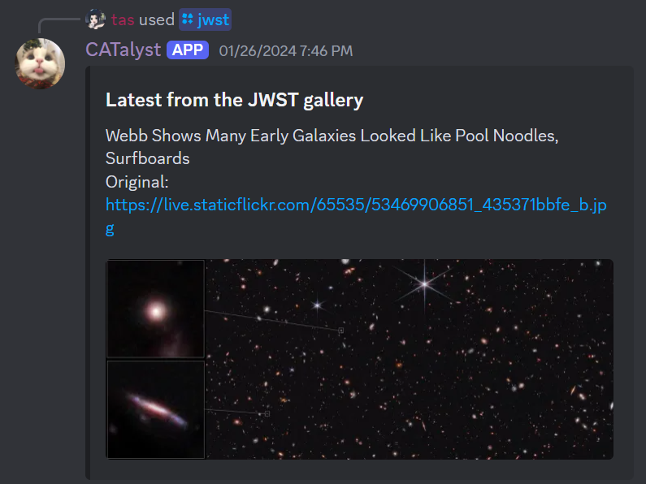
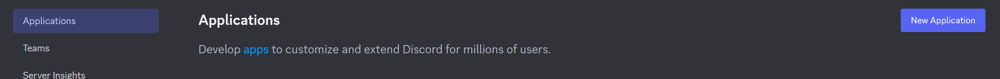
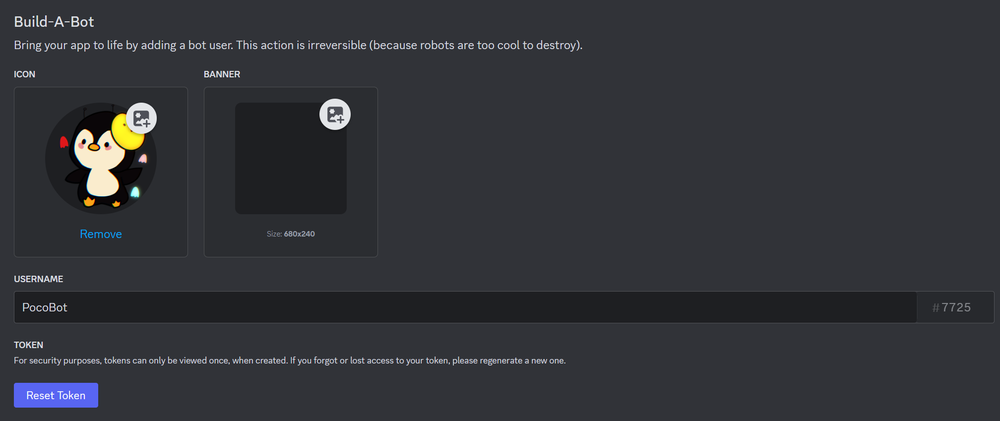
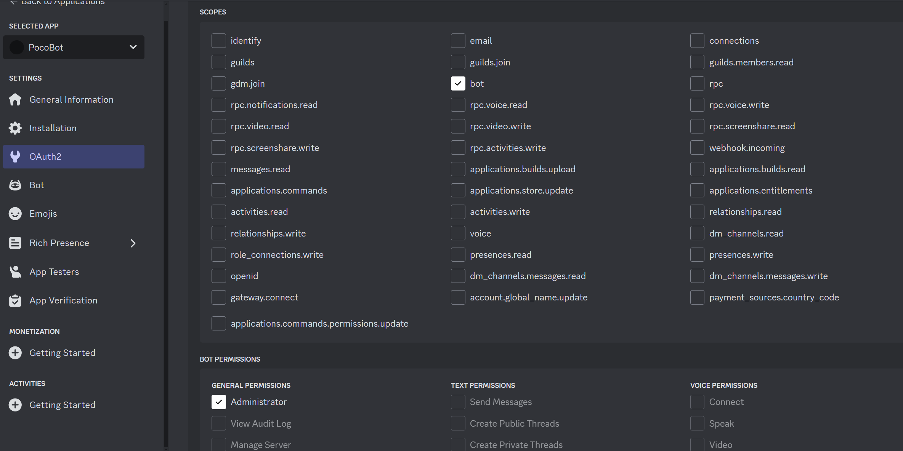
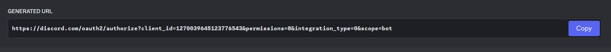
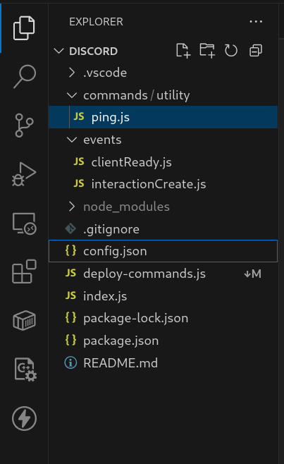
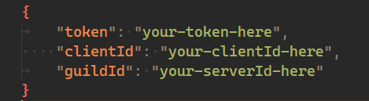
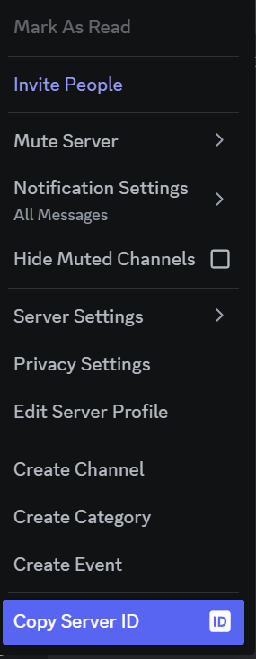
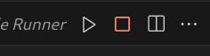

# Setting up your first Discord bot

## What is a Discord bot?

A feature of Discord is that it allows us to use bots&mdash;these are automated helpers that help run commands for us if we ask them to.
Interacting with bots is one of the most fun parts of using Discord!
Bots can:
- Help you administrate your server&mdash;Automatically assign roles to new joiners, ban people for saying certain words
- Run fun minigames
- Alert you of events happening
  - Some bots send messages when bosses spawn in an MMORPG
  - On my server with my friends, a bot monitors for when our Minecraft server is up or down and when people are online!

For example, this is a bot I made to give me the latest image from the JWST gallery. By running a simple command, it fetches the image for me and delivers it in a nice little discord message!

Let's go through setting up your own discord bot.

## Registering a bot application

First we need to register our application, which is like making an account for our bot.

1. Open the [Discord Developer Portal](https://discord.com/developers/docs/intro).
   Login if you need to.

2. Find the applications tab on the top left, and press `new application`. Create an application and give it a name.

3. Click on `Bot` in the left sidebar, then click on `Add Bot` to create a bot account and bot token.

4. Once your bot is created, you can give it a username and a picture in the `Bot` tab.

5. Go to the `OAuth2` tab and tick the following permissions:

6. Copy the link below the permissions tables at the very bottom of the `OAuth2` page.
   Open it in a web browser.

7. Select the server you made in the dropdown that shows to add your bot to the server.

You should see your bot join your server with a welcome message. We're done with actually making the bot! Yay!

## Adding code to our bot

Go back to the VSCode instance that opened when you logged in.
On the left, in the explorer pane, we can see all the files in our project.

If you can't see that, try hitting CTRL+Shift+E, or going to the menu bar at the top and pressing "View" then "Explorer".

Let's take a look at the files we have in our project so far.

### `index.js`

The index is where our robot will first start working from. The code to setup your bot is mostly filled in for you.
You probably will not need to modify this.

### `deploy-commands.js`

Deploy-commands contains the script that your repo uses to register the commands added to your bot. We'll learn more about this file and what it does when we explore the *slash command builder*, but you can also leave this one untouched for now.

### `package-lock.json`, `package.json`, 

`package.json` defines the name, version, and importantly, what *libraries* your project will use.
We will talk more about libraries in a little bit.
For now, you probably won't need to change this, but if you ever want to make your bot more powerful, you might need to modify this.

`package-lock.json` is a file describing what versions of each library you have installed, and is generated automatically.
You do **not** need to change this, ever.

### `.gitignore`

Ignore this!

### `config.json`

Your config file holds the specific information needed by **your** bot in particular. To fill in each field:

##### `token`:

Navigate back to your bot application in the discord developer portal, and go to the `bot` tab. Scroll down until you see the `reset token` button; click this and it should give you your bot's token that you can copy into the config file.
- It's important to note that your token should be kept as private as possible! if you share your token, other people could add code to and access your discord bot. Make sure you only put it into your `config.json` file and nowhere else.

> [!WARNING] Be careful with your bot token
> If anyone gets access to your token, they can impersonate your bot, and thus you!
> Never share it with anyone, and store it somewhere private.
> If you ever upload your code online to a platform like GitHub, make sure you don't distribute your token with it.

##### `clientId`:

Navigate to `general information` on the discord developer portal, and copy the text listed as **Application ID**. Paste this into your config file.

##### `guildId`:

Our coding interface refers to servers as 'guilds'. So, we need to pick which server we want our bot to be able to execute commands in. In your Discord app, right click the icon of the server you just made on the side. 

Click on `copy server id`, and then paste this into the guildid field in your config.json.

## Running our bot for the first time.

Now that we've linked our bot to our code using its token, we can try running it!

Inside VS Code, there should be a triangular start button in the top-right corner of the window.
Click it to start running the bot!

> [!FAILURE] I can't see that button!
> Let a mentor know!
> For now, you can run the bot by:
> 1. Opening a terminal
> 2. Running the command `npm start`

Whenever we make a change to our code, the bot will restart automatically, picking up our changes.
You can press the square stop button to turn off your bot.

To verify if it started, you can go into your server and look at the *member list* on the right side - if your bot powered on successfully, it should display under the 'online' category.
You should also see a message in the terminal tab at the bottom of your window.

Right now, our bot barely has any functionality! In fact, the only thing it can do is run a command called `ping`. To try it out, go into a channel of your server and type `/ping` in the message bar.
Let's give it some functionality!

